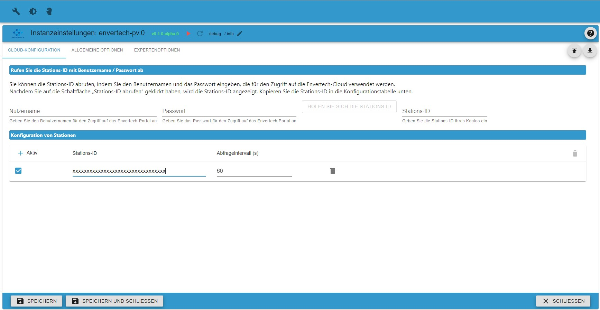
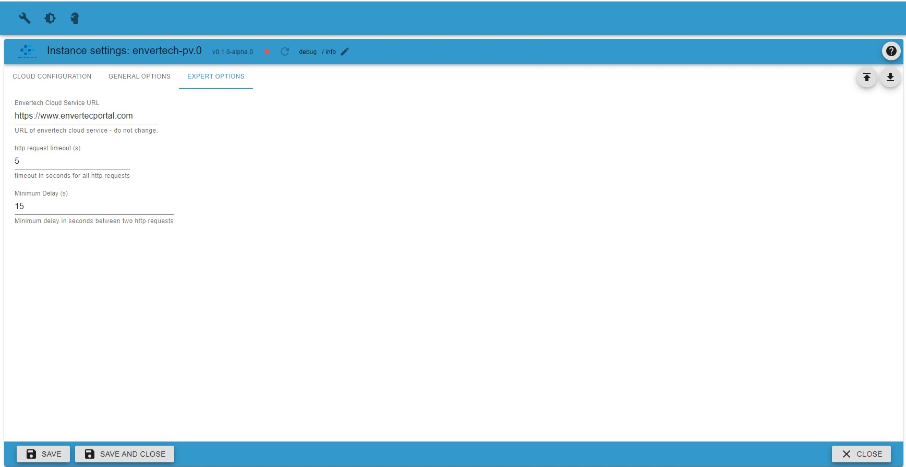

# Envertech-PV Adapter Information

## Allgemeine Informationen

Dieser Adapter ermöglicht es, Daten vom Envertech Cloud Service (www.envertecportal.com) abzurufen, indem der Webservice in regelmäßigen Abständen abgefragt wird. Alle abgerufenen Daten werden in Zuständen gespeichert, auf die Benutzer zugreifen können.

Der Zugang zum Envertech-Portal ist durch eine Kombination aus Benutzername und Passwort gesichert. Envertech unterstützt Endbenutzerkonten und Installationskonten. Dieser Adapter wurde nur mit Endbenutzerkonten getestet, die den Zugriff auf genau eine Installation pro Konto erlauben. Jedem Endnutzerkonto wird von Envertech eine Stations-ID zugeordnet. Der Adapter ermöglicht die Verwendung mehrerer Stations-Ids pro Adapterinstanz. Dies ermöglicht die Überwachung von mehr als einer Installation innerhalb einer Instanz.

Vom Envertech-Portal abgerufene Daten sind wie folgt strukturiert:

-   Stationsinformationen, identifiziert durch die Stations-ID
-   ein oder mehrere Gateways, die der durch die Gateway-Seriennummer identifizierten Station zugeordnet sind
-   ein oder mehrere Wechselrichter, die mit diesen Gateways verbunden sind

## Konfiguration

Wie zuvor beschrieben, wird jede Station durch ihre Station-ID identifiziert. Um die einem Benutzerkonto zugewiesene Station-ID abzurufen, geben Sie Benutzername und Passwort in die entsprechenden Felder auf der Registerkarte "Cloud-Konfiguration" ein und drücken Sie die Schaltfläche "Station-Id abrufen". Die Station-ID wird im Feld "Station-Id" angezeigt. Beachten Sie, dass die Adapterinstanz aktiv sein muss, damit der Abruf funktioniert.

Nachdem Sie die gewünschte Station-ID abgerufen haben, können Sie in der Tabelle "Liste der zu überwachenden Cloud-Stationen" eine oder mehrere Stationen konfigurieren - eine pro Zeile.

### TAB Cloud Konfiguration

| Parameter            | Typ      | Beschreibung                                               | Kommentar                                                              |
| -------------------- | -------- | ---------------------------------------------------------- | ---------------------------------------------------------------------- |
| Aktiv                | boolesch | Wenn markiert, wird die Station überwacht                  | kann verwendet werden, um eine einzelne Station zu deaktivieren        |
| Stations-ID          | Text     | Stations-ID, die die zu überwachende Station identifiziert | Geben Sie die mit Benutzername und Passwort abgerufene Stations-ID ein |
| Abfrageintervall (e) | Ganzzahl | Abfrageintervall                                           | Geben Sie das Intervall an, um Daten vom Cloud-Dienst abzurufen        |

### TAB Allgemeine Optionen

Hier legen Sie einige allgemeine Optionen fest

-   Protokollierung von HTTP-Anfragen aktivieren  
    Das Setzen dieser Option aktiviert die Protokollierung von HTTP-Anfragen und Antwortdaten während der Kommunikation mit dem Envertech Webservice.

-   Protokollierung neuer Datenschlüssel aktivieren  
    Das Setzen dieser Option aktiviert die Protokollierung einer Warnung, wenn neue Daten vom Envertech Webservice gemeldet werden, die noch nicht implementiert sind.

### TAB Experten Optionen

Hier können Sie einige spezielle Optionen festlegen. Es wird empfohlen, alle diese Optionen unverändert zu lassen, sofern nicht anders angegeben.

-   Envertech Cloud-Service-URL  
    Hier könnte die URL zum Zugriff auf den envertech Cloud Service geändert werden.

-   Http-Anforderungszeitüberschreitung (s)  
    Diese Option definiert ein allgemeines Timeout für alle HTTP-Anfragen. Der Wert wird in Sekunden angegeben.

-   Mindestverzögerung (s)  
    Diese Option definiert eine Mindestverzögerung in Sekunden zwischen dem Abschluss eines Abfragezyklus und dem Beginn des nächsten Zyklus.

## Weitere Informationen

Falls Sie die Stations-ID mit Benutzername und Passwort innerhalb des Adapters nicht abrufen können, können Sie Ihre Stations-ID auch auf diese Weise erhalten:

-   Melden Sie sich auf www.envertecportal.com an
-   Zeigen Sie den Quellcode der Webseite an, indem Sie mit der rechten Maustaste klicken und "Quelle anzeigen" auswählen
-   Suchen Sie nach "var stationId = ...". Der Code sollte wie folgt aussehen: „var stationId = '3EH583732993048DDX706VT57F8708452';“.
-   Sie benötigen die Zeichenfolge auf der rechten Seite ("3EH58373299348DDX706VT57F8708452").
-   Geben Sie diese Zeichenfolge in die Tabellenspalte mit der Bezeichnung Station-Id ein.
