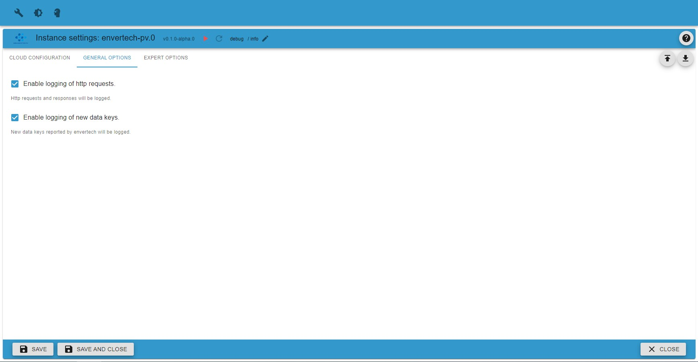

# Envertech-PV Adapter Information

## General information

This adapter allows to retrieve data from envertech cloud service (www.envertecportal.com) by polling the webservice at regular intervals. All data retrieved is stored at states accessible by users.

Access to envertech portal is secured by username / password combination. Envertech supports end user accounts and installation accounts. This adapter is only tested with end user accounts which allow access to exact one installation per account only. Each end user account is assigned to a station-id by envertech. The adapter allows cusage of multiple station-ids per adapter instance. This enables monitoring of more than one installation within one instance.

Data retrieved from envertech portal is strcutures the following way:

-   station information identified by station id
-   one or more gateways associated with the station identified by the gateways serial number
-   one or more inverter connected to those gateways.

## Configuration

As described earlier every station is identified by its station-id. Retrieving the station id assigned to a user accoutn can be performed by entering username and password into the corresponding fields at tab "Cloud Configuration" and press button "Get Station-Id". The statioon-id will be displayed at field "Station-Id". Note that the adapter instace must by active for the retrieval to work.

After retrieving the desired station-id you can configure one or more stations at table "List of Cloud-Stations to monitor" - one per line.

### TAB Cloud Configuration

| Parameter          | Type    | Description                               | Comment                                                |
| ------------------ | ------- | ----------------------------------------- | ------------------------------------------------------ |
| Active             | boolean | if marked, station will be monitored      | can be used to disable a single station                |
| Station-Id         | text    | Station-Id identifying station to monitor | enter station-id retrieved using username and password |
| Poll Intervall (s) | integer | polling interval                          | specify intervall to poll data from cloud service      |

### TAB General Options

Here you specify some general options

-   Enable logging of http requests  
    Setting this option activates logging of hhtp request and resonde data while communicating with envertech webservice.

-   Enable logging of new data keys  
    Setting this option activates logging of a warning if some data is reported by envertech webservice which is not yet implemented.

### TAB Expert Options

Here you can specify some special options. It is recommended to keep all those options unchanged unless instructed otherwise.

-   Envertech cloud service url  
    The url to access the envertech cloud service could be changed here.

-   Http request timeout (s)  
    This option defines a general timeout for all http requests. The value is specified as seconds.

-   Minimum delay (s)  
    This option defined a minimum delay in seconds between the completion of a poll cycle and start of the next cycle..

## Additional Information

In case retrieving the station-id using username and password within the adapter, you can get your station-id this way too:

-   Sign in at www.envertecportal.com
-   Display the source code of the webpage by right-clicking and selectiong "Show source"
-   Search for "var stationId = ...". The code should look like "var stationId = '3EH583732993048DDX706VT57F8708452';".
-   You need the string at the right side ("3EH58373299348DDX706VT57F8708452").
-   Enter this string into the table column labeled Station-Id.
